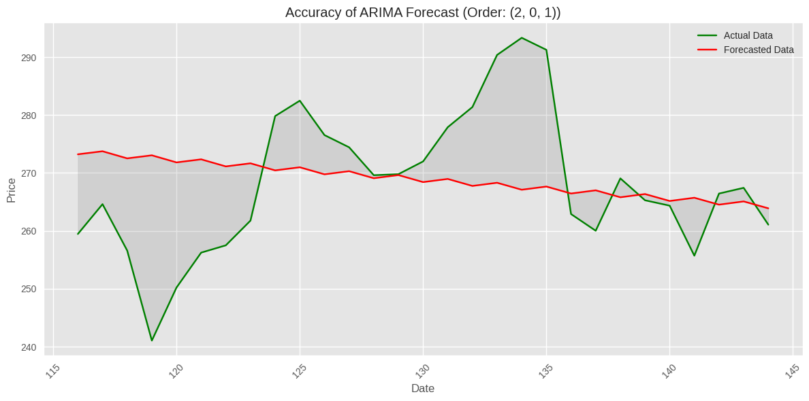

# ARIMA Model Forecast for Tesla Stock Prices

## Overview

This project involves using the **ARIMA (AutoRegressive Integrated Moving Average)** model to forecast Tesla's stock prices over the period from **January 1, 2023** to **August 2, 2023**. The ARIMA model is widely used for time series analysis and forecasting, and this project demonstrates its application on real-world stock market data.

---

## Table of Contents
- [Project Goals](#project-goals)
- [Data](#data)
- [ARIMA Model](#arima-model)
- [Implementation](#implementation)
- [Results](#results)
- [Visualization](#visualization)

---

## Project Goals

1. Analyze historical stock data for Tesla.
2. Develop and fine-tune an ARIMA model for accurate forecasting.
3. Visualize the forecasted stock prices alongside actual values.
4. Provide insights and evaluate the model's performance.

---

## Data

- **Source**: Tesla's stock data was retrieved from [Yahoo Finance](https://finance.yahoo.com/).
- **Timeframe**: January 1, 2023 – August 2, 2023.
- **Attributes**:
  - Date
  - Open Price
  - Close Price
  - High Price
  - Low Price
  - Adjusted Close Price
  - Volume

---

## ARIMA Model

The ARIMA model is a popular statistical method for time series forecasting. It combines three components:
- **AR (AutoRegressive)**: Dependency on its own lagged values.
- **I (Integrated)**: Differencing of raw observations to achieve stationarity.
- **MA (Moving Average)**: Dependency on lagged forecast errors.

### Model Configuration
- **Order (p, d, q)**: Determined through **ACF (Autocorrelation Function)** and **PACF (Partial Autocorrelation Function)** analysis.
  - `p`: Number of lag observations included.
  - `d`: Degree of differencing.
  - `q`: Size of the moving average window.

---

## Implementation

1. **Data Preprocessing**:
   - Load Tesla stock data.
   - Perform exploratory data analysis (EDA) to understand trends and stationarity.
   - Apply transformations (e.g., log transformation) if necessary to stabilize variance.

2. **Model Training**:
   - Use the `statsmodels` library to implement the ARIMA model.
   - Tune the parameters `(p, d, q)` using grid search or manual inspection.

3. **Forecasting**:
   - Generate forecasts for the specified period.
   - Visualize the predicted and actual values for comparison.

4. **Evaluation**:
   - Assess the model using metrics like **Mean Absolute Error (MAE)** and **Root Mean Squared Error (RMSE)**.

---

## Results

The ARIMA model successfully forecasted Tesla's stock prices for the specified timeframe. Key findings include:

- **Trend Prediction**: The model captured general price trends effectively.
- **Anomalies**: The model struggled with abrupt price jumps or external market shocks.
- **Performance Metrics**:
  - MAE: _173.9899804456624_
  - RMSE: _13.190526162578292_

### Visualization

